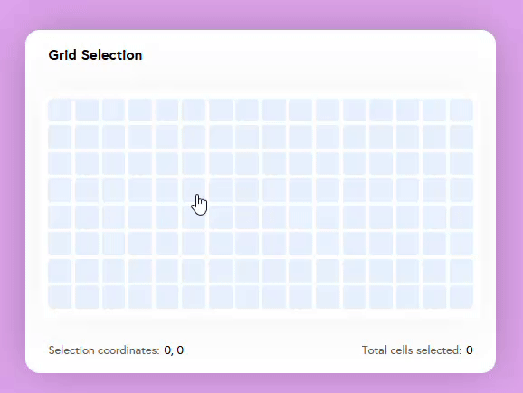

# Symbols Grid Selection CLI

A command-line tool to generate Grid Selection Components based on customizable row and column counts.

## Features
- Clone the [`symbols-grid-selection`](https://github.com/leticia-chijo/symbols-grid-selection) repository.
- Generate a `GridSelection` component with a specified number of columns and rows.
- Default grid size: 16 columns × 8 rows.



## Installation

Ensure you have [Node.js](https://nodejs.org/) installed on your system.

### Clone the repository
```bash
$ git clone https://github.com/leticia-chijo/symbols-grid-selection.git
```

### Navigate to the project folder
```bash
$ cd symbols-grid-selection
```

## Usage

### Initialize the project
Clones the symbols-grid-selection repository if it doesn't already exist.
```bash
$ node cli.js init
```

### Create a Grid Selection component

Generates a GridSelection component with a specified number of columns and rows.
```bash
$ node cli.js create <cols> <rows>
```
- `<cols>`: Number of columns (default: 16)
- `<rows>`: Number of rows (default: 8)

#### Example
```bash
$ node cli.js create 10 5
```
This creates a new file: `GridSelection-10x5.js`.
